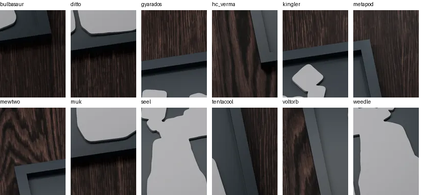
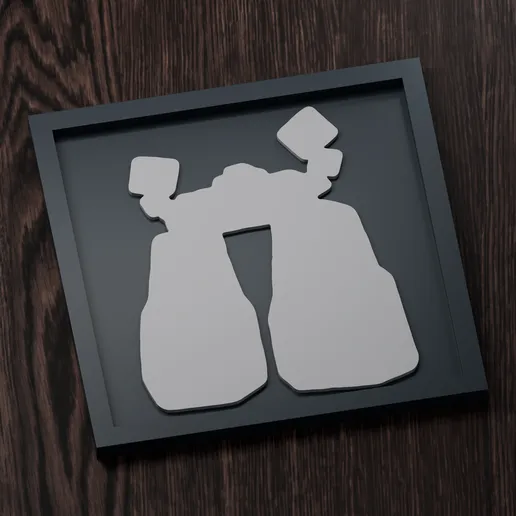
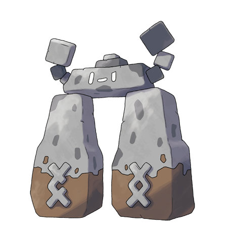

# Who's That Pokemon?

- **Category:** Web (+ image puzzle)
- **Flag:** `0x1337{stonjourner}`
- **Service:** `http://40.81.242.56:30354` (mirrors on `:30548`, `:30570`, which serve identical content)
- **Files:** [`files/solve.py`](files/solve.py) (jigsaw solver), [`files/solved.png`](files/solved.png) (reassembled image), [`files/pieces/`](files/pieces/) (the 12 original tiles), [`files/montage.png`](files/montage.png) (unsorted tiles), [`files/image.png`](files/image.png) (decoy), [`files/stonjourner_reference.png`](files/stonjourner_reference.png) (official artwork for comparison)

## Challenge

> wait, who's that pokemon? oh wait, im a robot, i can't tell!
>
> Your flag should be of the format `0x1337{pokemon_name}`. For example, if the name of the pokemon is magmar, the flag would be `0x1337{magmar}`.

## Recon

The index page is a static Express/Helmet page with a single image:

```html
<h1>Who's that Pokemon?</h1>

```

`image.png` is a 1254×1254 picture of Pikachu. That is too easy to be the answer, so it is a decoy.

The "I'm a robot" line in the prompt points at `robots.txt`:

```
$ curl http://40.81.242.56:30354/robots.txt
pieces/
```

`/pieces/` has directory listing turned on and shows 12 PNGs:

```
bulbasaur.png  ditto.png    gyarados.png  hc_verma.png
kingler.png    metapod.png  mewtwo.png    muk.png
seel.png       tentacool.png voltorb.png  weedle.png
```

The Gen-1 file names (and the `hc_verma` joke) are red herrings. Every file is a 129×172 RGBA tile cut from one larger photo: a dark wooden table with a black shadow-box frame holding a grey silhouette cut-out.



## Reassembling the jigsaw

12 tiles can form a 3×4, 4×3, 2×6 or 6×2 grid. [`solve.py`](files/solve.py) does the following:

1. Computes a cost for every ordered pair of tiles: the mean absolute RGB difference between touching border pixel rows or columns, once for left-right and once for top-bottom.
2. Fills the grid in row-major order with a beam search (width 5000). The cost of each placement is the seam cost to its left and top neighbours.
3. Keeps the grid shape with the lowest average seam cost.

```
3 4 2.90  ['mewtwo','gyarados','kingler','metapod',
           'voltorb','seel','weedle','tentacool',
           'hc_verma','muk','ditto','bulbasaur']
4 3 8.09  ...
2 6 7.55  ...
6 2 3.92  ...
```

The 3-row × 4-column layout wins clearly, and the result is one continuous image (516×516):



## Identifying the silhouette

The silhouette shows:

- two tall, slab-like pillars standing side by side,
- joined at the top by a horizontal lintel, so the outline looks like a trilithon (Stonehenge),
- small square blocks floating above it: one on the left, and a larger and a smaller one on the right.

That is **Stonjourner** (#874, the Big Rock Pokémon from Gen 8), whose design is based on Stonehenge. Its official artwork has the two pillar legs, the lintel head, and the floating stone blocks in the same arrangement: one on the left, two on the right.



I ruled out other candidates by comparing their outlines against the official artwork: Binacle, Conkeldurr, Tandemaus and Diglett/Dugtrio.

## Flag

```
0x1337{stonjourner}
```

## Takeaways

- A "robot" hint in a web challenge almost always means check `robots.txt`.
- Directory listing on a hidden path gives away all the assets at once.
- File names and the obvious image (Pikachu) can both be decoys. Trust the pixels, not the names.
- Shuffled equal-size tiles can be solved automatically by matching border pixels with a small beam search, so there is no need to drag pieces around by hand.
